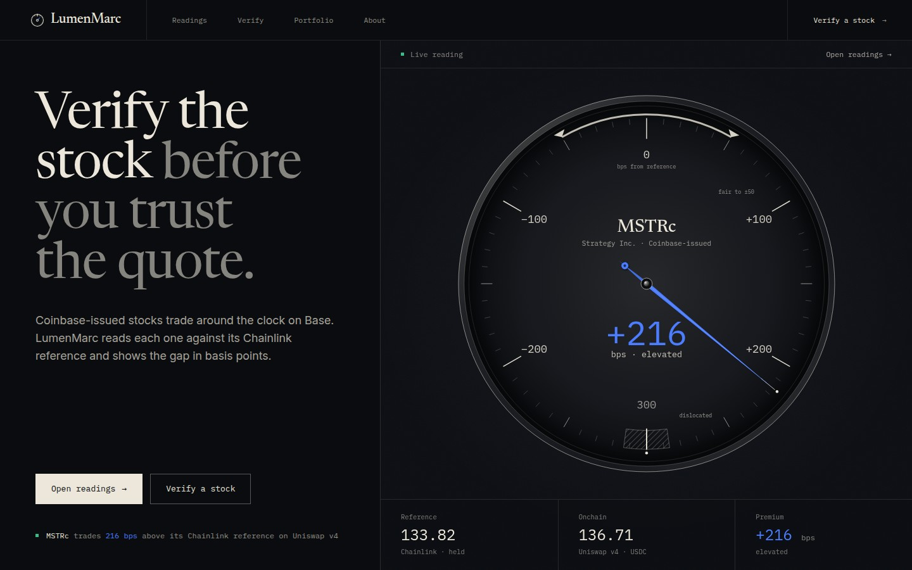
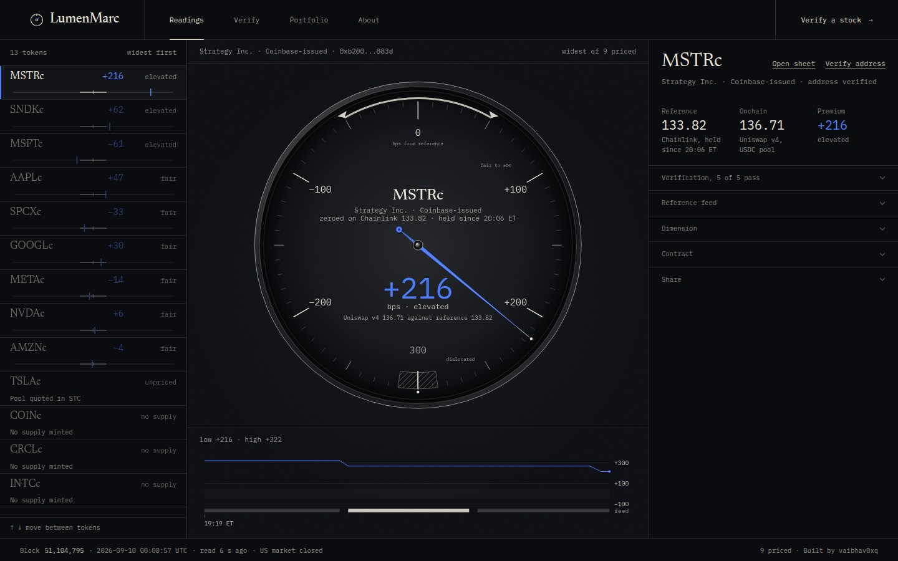
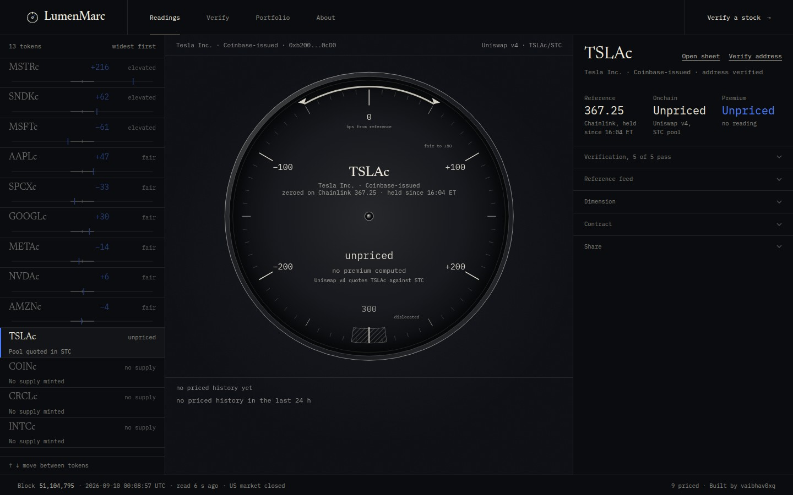
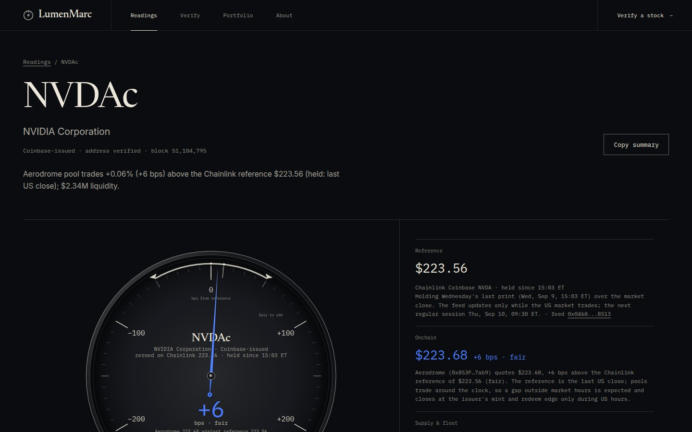
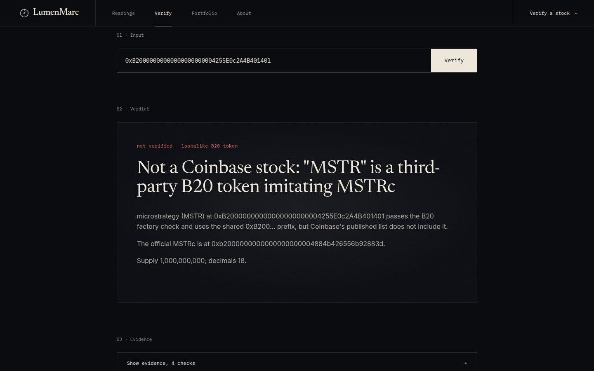
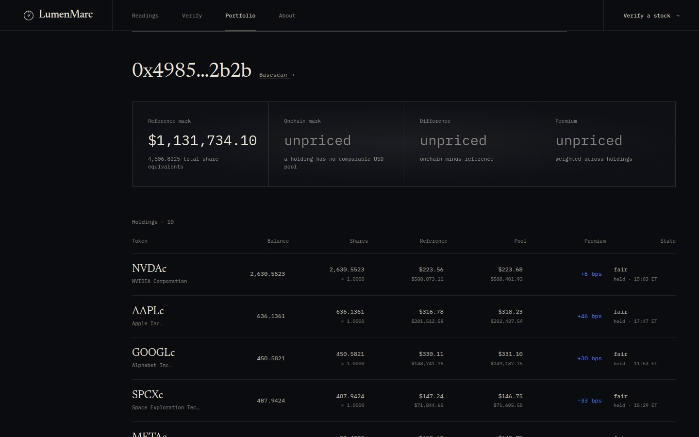

<div align="center">

# LumenMarc

**A clear market mark for tokenized stocks.**

Read-only fair-value and integrity layer for Coinbase Tokenized Stocks (B20 tokens) on Base.
Verify the token, compare the onchain price with its Chainlink reference and see what one token represents.

[**Live app**](https://lumenmarc.netlify.app) · [**Source**](https://github.com/vaibhav0xq/lumenmarc) · [**JSON API**](#public-json-api) · [**Research**](docs/research/base-builder-quest-report.md)

`React 19` `Vite 7` `Tailwind 4` `Express 5` `viem` `Zod` `Drizzle` `Postgres` `Netlify Functions` `MIT`

</div>



---

## Contents

1. [What it does](#what-it-does)
2. [Screenshots](#screenshots)
3. [Why it exists](#why-it-exists)
4. [Feature summary](#feature-summary)
5. [Architecture](#architecture)
6. [Data sources](#data-sources)
7. [Integrity rules](#integrity-rules)
8. [Public JSON API](#public-json-api)
9. [Running locally](#running-locally)
10. [Deployment](#deployment)
11. [Repository map](#repository-map)
12. [Limitations](#limitations)
13. [Disclosures](#disclosures)
14. [Research and evidence](#research-and-evidence)
15. [Contributing, security and license](#contributing-security-and-license)

---

## What it does

Coinbase Tokenized Stocks are B20 tokens issued by Coinbase on Base. They trade around the clock in permissionless DEX pools while the underlying US stock trades only during the NYSE session. LumenMarc answers three factual questions about any of them, in one screen and in one JSON call:

| Pillar | Question | How LumenMarc answers it |
| --- | --- | --- |
| **Verify** | Is this token the Coinbase-issued stock or a lookalike? | Address pinned against Coinbase's published list, B20 factory check, onchain symbol and name, Chainlink feed presence, pause flags |
| **Price** | Is the pool price fair versus the real stock? | Live DEX pool prices compared with the official Chainlink "Coinbase TICKER" total-return reference: premium or discount in basis points, oracle freshness and US market session state |
| **Own** | What does one token represent? | Multiplier, share-equivalents, dividend and custody policy, ISIN and CUSIP, total supply, corporate-action status |

Everything is computed from public onchain data and public APIs. There is no wallet connection, no custody, no order routing and no recommendation. LumenMarc is informational market-integrity infrastructure, not a brokerage and not investment advice.

Built for the **Base Build Builder Quest for Tokenized Stocks** (September 2026) by [vaibhav0xq](https://github.com/vaibhav0xq).

---

## Screenshots

Captured from the live deployment on Sep 10, 2026 (US market closed, Chainlink feeds holding the last regular-session print).

| | |
| --- | --- |
|  |  |
| **Readings.** Every listed token on one rail, widest reading first. The dial and sheet follow the selected token; the trace below shows the last 24 hours of readings. | **Unpriced, on purpose.** The only TSLAc pool is quoted against a third-party token. LumenMarc shows no converted USD price and computes no premium. |
|  |  |
| **Sheet.** One token in full: reference feed and freshness, onchain price with the venue behind it, supply and float, verification checks, size check, corporate actions and disclosures. | **Verify.** A third-party B20 token that passes the factory check and uses the shared `0xB200` prefix is still not a Coinbase stock. The verdict names the official address. |
|  | |
| **Portfolio.** Any address or Basename, read-only: balances, share-equivalents, reference-priced value and the premium per holding. A holding without a USD-comparable pool leaves the onchain mark unpriced. | |

---

## Why it exists

Coinbase Tokenized Stocks launched natively on Base on Aug 24, 2026. Within two weeks the onchain market already showed every failure mode a retail user could walk into. All of the following was measured live by LumenMarc on Sep 7, 2026 (US Labor Day, market closed) and is recorded in [docs/research/onchain-snapshot-2026-09-07.md](docs/research/onchain-snapshot-2026-09-07.md):

- **Lookalikes pass the obvious checks.** Anyone can deploy a B20 token and B20 addresses share the `0xB200` prefix. A token named "NVIDIA Curenncy" with the symbol `NVDAc`, a token called `GOOGLc` and a "microstrategy" `MSTR` token at `0xB20000000000000000000004255E0c2A4B401401` were all trading. All three pass `B20Factory.isB20()`. None is Coinbase-issued.
- **Pool prices drift far from the real stock.** `AMZNc` traded 10.6% above the Chainlink reference in a $3.7K Uniswap v4 pool; `MSTRc` 3.7% above; `SNDKc` 3.1% above. The only `TSLAc` pool is quoted against a third-party token, which made its inferred USD price read about four times the real stock. That number is meaningless, so LumenMarc neither shows it nor turns it into a premium.
- **Reference prices freeze when the US market is closed.** Chainlink feeds hold Friday's last print over weekends and holidays while pools trade 24/7. Users need to know whether a gap is expected (feed *held*) or anomalous (feed *stale*).
- **Ownership is not 1 token = 1 share forever.** Cash dividends are converted to share-equivalents by raising the token's multiplier; the total-return reference already reflects this. Nothing in a wallet or DEX UI shows it.

LumenMarc turns those facts into a reading a person can take in a few seconds and a JSON API that any wallet, aggregator or dashboard can embed.

---

## Feature summary

- **Instrument view** (`/`, `/readings`): one dial per token showing the premium or discount in basis points against the Chainlink reference, the deviation state in words (`fair`, `elevated`, `dislocated`, `unpriced`) and the feed state (`live`, `held`, `stale`, `unavailable`). A 24 hour trace of readings sits under the dial.
- **Sheet** (`/s/:ticker`): verification checks, reference feed and freshness, primary venue and all other pools, supply and float, share-equivalents, size check, corporate actions, disclosures and integration snippets. A **Copy summary** action produces a neutral plain-text summary with the block number.
- **Verify** (`/check?q=`): a verdict for a ticker, token address, pool address, Uniswap v4 pool id, wallet address or Basename, with the evidence behind it and the official address when the input is a lookalike.
- **Portfolio** (`/portfolio/:account`): positions, share-equivalents and reference-priced value for any address or Basename. Read-only, no connection.
- **Embed** (`/embed/:ticker`): a compact card that works inside an iframe.
- **Size check**: a constant-product estimate of price impact for a USD amount on the primary pool, combined with the current premium into a signed all-in figure. Refused when the venue is unpriced.
- **Public JSON API**: everything above as open `GET` endpoints, each response parsed against the OpenAPI contract before it leaves the process.

---

## Architecture

```
Base mainnet (viem, public RPCs with fallbacks) ─────────┐
  listed B20 tokens: symbol, name, decimals, totalSupply, │
  multiplier, isPaused(mint/burn/transfer), contractURI,   │
  extraMetadata(isin, cusip); B20 factory isB20()          │      ┌────────────────────────┐
  Chainlink "Coinbase TICKER" feeds: latestRoundData,      ├────▶ │ Snapshot + label engine │
  description, decimals                                   │      │ feed state             │      ┌─────────────────┐
  Basenames L2 resolver (forward and reverse)             │      │ venue ranking          │ ───▶ │ Express 5 API   │ ───▶ React UI
                                                          │      │ premium and deviation  │      │ /api/*          │      /, /readings, /s/:ticker,
DexScreener public API ───────────────────────────────────┤      │ alerts and lookalikes  │      │ Zod-validated   │      /check, /portfolio,
  every Base pool for the listed tokens,                  │      │ share-equivalents      │      └─────────────────┘      /embed/:ticker, /about
  lookalike scan by ticker                                │      └───────────┬────────────┘
                                                          │                  │
NYSE calendar 2026 to 2028 (in repo) ─────────────────────┘                  ▼
                                                             Postgres: premium_snapshots (14 day retention)
```

**Packages** (pnpm workspace):

| Package | Role |
| --- | --- |
| `artifacts/api-server` | Express 5 API mounted at `/api`. Onchain readers, DexScreener client, NYSE calendar, label engine, snapshot worker, routes. Three entries: `index.ts` (long-running server), `netlify.ts` (Netlify Function via `serverless-http`), `vercel.ts` (Vercel function) |
| `artifacts/lumenmarc` | React 19 + Vite 7 + Tailwind 4 front end. Wouter routing, TanStack Query for data, generated typed hooks from the API contract |
| `lib/api-spec` | `openapi.yaml`, the single API contract. Orval generates `lib/api-zod` (schemas used by the server to validate every response) and `lib/api-client-react` (typed fetch hooks used by the UI) |
| `lib/db` | Drizzle schema for `premium_snapshots`. Optional at runtime |
| `scripts` | Plain Node scripts that assemble the Netlify and Vercel deployments |
| `artifacts/mockup-sandbox` | Component preview sandbox used during design work on Replit. Not deployed and not part of the product |

**Snapshot lifecycle**

- One un-chunked multicall for tokens, one for feeds, one DexScreener sweep, then classification. Public Base RPCs reject chunked or parallel multicalls, so reads are sequential and batched at the RPC level.
- Long-running mode (`index.ts`): a background worker refreshes every 60 seconds and requests are served from memory.
- Serverless mode (Netlify, Vercel): a function instance recomputes when its in-memory snapshot is older than 45 seconds; concurrent requests share one computation. Read endpoints send `Cache-Control` headers so the CDN absorbs bursts.
- Lookalike scan every 10 minutes. `/check` and `/portfolio` read the chain on demand.
- With `DATABASE_URL` set, a row per token is written at most every 50 seconds and kept for 14 days. `GET /api/cron/snapshot` lets an external scheduler keep history continuous on serverless hosts.

**Identity is the address.** The pinned official list in `artifacts/api-server/src/lib/b20/addresses.ts` is the only thing that makes a token "Coinbase-issued". `isB20()`, the `0xB200` prefix and onchain metadata are displayed but never trusted, because third-party tokens satisfy all three.

---

## Data sources

| Source | What is read | Notes |
| --- | --- | --- |
| Base mainnet RPC | B20 token state (`symbol`, `name`, `decimals`, `totalSupply`, `multiplier`, `isPaused(uint8)`, `contractURI`, `extraMetadata`, `scaledBalanceOf`), `B20Factory.isB20()`, Chainlink `latestRoundData` | Public RPCs `mainnet.base.org`, `base-rpc.publicnode.com`, `base.drpc.org`, `1rpc.io/base` behind a fallback transport. `BASE_RPC_URL` adds a keyed endpoint first |
| Chainlink "Coinbase TICKER" feeds | Reference price, 8 decimals, total-return | The feed and the token multiplier stay comparable after dividends |
| DexScreener public API | Every Base pool for the listed tokens (price, liquidity, quote asset, DEX), lookalike search by ticker | Bounded in-process cache; rate-limited upstream |
| Basenames L2 resolver | Forward and reverse resolution for `/check` and `/portfolio` inputs | Onchain, no third-party API |
| NYSE calendar | Regular session, early closes and holidays for 2026 to 2028 | Maintained in the repo, drives `live`, `held` and `stale` |
| Coinbase's published token list | The addresses that define "Coinbase-issued" | Pinned in `addresses.ts` with the matching Chainlink feed for each ticker |

B20 tokens are Base-native precompiles at `0xB200` addresses with no bytecode and no verified source. `paused()` reverts, so feature pauses are read with `isPaused(uint8)`. `extraMetadata("isin")` uses a lowercase key. `scaledBalanceOf` returns share-equivalents.

---

## Integrity rules

These rules are enforced in the API, checked against the OpenAPI schemas and mirrored in the UI.

1. **Nothing is mocked.** Every number comes from a Base RPC call, a Chainlink round, DexScreener or arithmetic on those. There are no placeholder values, sample data or hardcoded counts.
2. **A failed read never becomes a default.** If a refresh fails after a first success, the previous block-stamped snapshot is kept: every payload carries its block number and `updatedAtUtc`, the readings page shows both and `/api/cron/snapshot` reports the last refresh error as `warning`. Before the first successful read the API answers `503 snapshot_unavailable` with the reason. A position whose reference feed is `unavailable` is listed with a zero reference price and value and flagged with its `feedState` rather than priced from something else.
3. **Only USD-stablecoin quotes are priced.** A pool is compared with the Chainlink reference only when its counter-asset is a recognised USD stablecoin (USDC on Base). Pools quoted in anything else, including ETH/WETH or another Coinbase-issued stock, are `unpriced`: the venue carries a warning that explains why and the overview raises an alert for the pool. For an unpriced pool `priceUsd` and `poolPrice` are `null`, no premium is computed and the size check is refused with `422`. A USD figure inferred through the counter-asset's own market never leaves the process. This is why TSLAc reads "Unpriced" everywhere.
4. **Feed state is judged against the market calendar.** `live` while the feed prints during the regular session (a print since 15 minutes before the open counts; the first 20 minutes after the open are a grace period) or within the last 15 minutes in extended hours; `held` when the US market is closed and the feed holds the last print; `stale` when the market has been open for more than 20 minutes without a print since the open or when the last print is more than 26 hours old; `unavailable` when the feed cannot be read or returns a non-positive answer.
5. **Deviation thresholds are fixed and stated.** `fair` within 50 bps of the reference, `elevated` from 50 to 300 bps, `dislocated` above 300 bps.
6. **Venues are ranked, then trusted in that order.** USD-stablecoin pools rank first, then by liquidity; the first is the primary venue that drives the headline. Pools under $25K liquidity carry a thin-liquidity warning.
7. **Identity comes from the pinned list only.** A token that passes `isB20()`, carries the `0xB200` prefix and copies the name and symbol is still reported as a lookalike when its address is not on Coinbase's list.
8. **Every product response is parsed against the contract** before it is sent. A payload that does not fit the schema generated from `openapi.yaml` is a `500`, not a partially rendered page. Error bodies share one shape and the operational cron endpoint is outside the contract.

---

## Public JSON API

All endpoints are `GET` under `/api` and need no key. The one exception is `/api/cron/snapshot`, which requires `Authorization: Bearer <CRON_SECRET>` once that secret is configured. The contract is [`lib/api-spec/openapi.yaml`](lib/api-spec/openapi.yaml); the cron endpoint is operational and sits outside it.

| Endpoint | Returns |
| --- | --- |
| `/api/healthz` | Liveness |
| `/api/market` | US session state (`open`, `premarket`, `afterhours`, `closed`, `holiday`), next open and close |
| `/api/overview` | Session, integrity alerts, aggregate float and liquidity, every stock ranked by dislocation |
| `/api/stocks` | Compact rows for every listed stock |
| `/api/stocks/{ticker}` | The full label: `summary`, `verify`, `price`, `own`, `supply`, `venues`, `pauses`, `metadata`, `corporateActions`, `disclosures`, `history`, `shareText` |
| `/api/history?ticker=NVDAc&window=24h` | Premium history points (reference, pool price where USD-comparable, premium bps, feed state). Windows: `1h`, `6h`, `24h`, `7d` |
| `/api/size-check?ticker=NVDAc&amountUsd=10000&side=buy` | Estimated impact and all-in figure versus the reference; `422` when the venue is unpriced |
| `/api/check?q=...` | A verdict for a ticker, token address, pool address, Uniswap v4 pool id, wallet address or Basename |
| `/api/portfolio/{account}` | Positions, share-equivalents and reference-priced value for an address or Basename |
| `/api/cron/snapshot` | Refreshes the snapshot when it is stale and reports the last refresh error as `warning`. With `CRON_SECRET` set, callers must present the bearer secret and every call forces a refresh |

Errors are JSON with the shape `{ "error", "code" }`. Missing or invalid query parameters return `400 bad_request`; unknown tickers return `404 unknown_ticker`; an account that is neither an address nor a resolving Basename returns `404 unresolvable_account`; a size check on an unpriced venue returns `422 unpriced_venue`; history without a database returns `503 history_disabled`; a snapshot that has never been computed returns `503 snapshot_unavailable`; a failed balance read returns `502 rpc_read_failed`. Anything unexpected is a `500 internal_error` with the message, never an HTML error page.

```bash
APP=https://lumenmarc.netlify.app

curl -s "$APP/api/check?q=0xB20000000000000000000004255E0c2A4B401401" | jq '{kind, verdict, headline}'
# {
#   "kind": "lookalike-b20",
#   "verdict": "danger",
#   "headline": "Not a Coinbase stock: \"MSTR\" is a third-party B20 token imitating MSTRc"
# }

curl -s "$APP/api/stocks/TSLAc" | jq '{ticker: .summary.ticker, reference: .price.reference.price, poolPriceUsd: .price.primaryVenue.priceUsd, premiumBps: .price.premiumBps, deviationState: .price.deviationState}'
# {
#   "ticker": "TSLAc",
#   "reference": 367.24995,
#   "poolPriceUsd": null,
#   "premiumBps": null,
#   "deviationState": "unpriced"
# }
```

Embeddable card: `/embed/{ticker}`.

---

## Running locally

Requirements: Node.js 20 or newer (22 recommended) and pnpm 10 (`corepack enable` picks up the pinned version). Postgres is optional.

```bash
git clone https://github.com/vaibhav0xq/lumenmarc.git && cd lumenmarc
pnpm install
cp .env.example .env                        # optional: every variable is optional and nothing reads .env automatically,
set -a; source .env; set +a                 # so export the values you filled in before starting
pnpm --filter @workspace/db run push        # only if DATABASE_URL is set: creates premium_snapshots
pnpm --filter @workspace/api-server run dev # API on $PORT (default 8080), mounted at /api, refresh every 60 s
pnpm --filter @workspace/lumenmarc run dev  # UI on $PORT (default 5173); /api is proxied to the API in dev
```

- `pnpm run typecheck` checks every package.
- Editing `lib/api-spec/openapi.yaml` requires `pnpm --filter @workspace/api-spec run codegen`, which regenerates `lib/api-zod` and `lib/api-client-react`.
- No API keys are required. A keyed Base RPC (`BASE_RPC_URL`) only makes refreshes more reliable.

| Variable | Required | What it does |
| --- | --- | --- |
| `BASE_RPC_URL` | no (recommended in production) | Keyed Base RPC endpoint tried before the public RPCs |
| `DATABASE_URL` | no | Postgres for the premium-history series; without it history endpoints answer `history_disabled` |
| `PUBLIC_APP_URL` | no | Canonical origin used in the API's `shareText` links; falls back to the request host. The UI's embed snippet uses the page's own origin |
| `CRON_SECRET` | no | Bearer secret that allows forced refreshes on `GET /api/cron/snapshot` |
| `LOG_LEVEL` | no | pino log level, default `info` |
| `API_PROXY_TARGET` | no (dev only) | Where the Vite dev server forwards `/api` |

---

## Deployment

The production deployment is **Netlify**: the Vite front end as static files and the Express API as one Netlify Function behind `/api/*`, built from `main` on every push. The same code also deploys to **Vercel**. Both paths are documented step by step:

- [docs/DEPLOY_NETLIFY.md](docs/DEPLOY_NETLIFY.md): settings, environment variables, how history behaves on serverless, smoke test, CLI deploy
- [docs/DEPLOY_VERCEL.md](docs/DEPLOY_VERCEL.md): the Build Output API equivalent

```bash
pnpm run build:netlify           # reproduces the Netlify build: artifacts/lumenmarc/dist/public + netlify/functions/api
pnpm run build:vercel            # reproduces the Vercel build: .vercel/output/
node scripts/vercel-serve.mjs    # serves the Vercel output on http://localhost:3000
```

Any Node host works too: `pnpm --filter @workspace/api-server run build` produces `dist/index.mjs` (listens on `PORT`, keeps the background refresh loop) and `BASE_PATH=/ pnpm --filter @workspace/lumenmarc run build` produces the static site in `artifacts/lumenmarc/dist/public`.

---

## Repository map

```
artifacts/api-server/src/
  lib/b20/addresses.ts          Official tokens and feeds, factory, quote assets (source of truth)
  lib/b20/{abi,chain,readers}.ts ABIs, viem client with fallback RPCs, multicall readers
  lib/market/hours.ts           NYSE session calendar and state
  lib/label/engine.ts           Feed and deviation classification, venue ranking, alerts, label copy
  lib/venues/dexscreener.ts     DexScreener client with a bounded cache
  lib/snapshot/worker.ts        Snapshot refresh (worker or on-demand), lookalike scan, persistence
  lib/basename.ts               Basenames forward and reverse resolution
  routes/                       market, overview, stocks, history, size-check, check, portfolio, cron, health
  index.ts | netlify.ts | vercel.ts   Server entry, Netlify Function entry, Vercel function entry
artifacts/lumenmarc/src/
  pages/                        landing, readings, label (sheet), check, portfolio, embed, about, not-found
  components/instrument/        Comparator dial, premium trace, dimension figure, rail, sheet panel
lib/api-spec/openapi.yaml       API contract; Orval generates lib/api-zod and lib/api-client-react
lib/db/                         Drizzle schema for premium_snapshots
scripts/                        netlify-build.mjs, vercel-build.mjs, vercel-serve.mjs
netlify.toml, vercel.json       Host configuration
docs/DEPLOY_NETLIFY.md          Netlify guide (production)
docs/DEPLOY_VERCEL.md           Vercel guide
docs/design/instrument-style.md The shipped visual system: dark instrument, Newsreader display serif, motion rules
docs/research/                  Research report, onchain snapshot, source registry and captured sources
docs/screenshots/               The screenshots used in this README
```

---

## Limitations

- Public Base RPCs and DexScreener's public API are the data sources. Both are rate-limited, so the snapshot cadence is 60 seconds and `/check` or `/portfolio` can take a few seconds on a cold address.
- Premium history only accumulates while a snapshot is being computed. On serverless hosts that means traffic or a scheduler hitting `/api/cron/snapshot`; without either, the trace has gaps.
- The size check is a constant-product approximation on the primary pool. It is an estimate, not a quote. It ignores routing across pools.
- The NYSE calendar is maintained in the repo through 2028 and logs a warning beyond that.
- No Coinbase corporate action (dividend or split) had been processed onchain as of Sep 10, 2026, so the corporate-action panel shows the multiplier state rather than a history of events.
- Tokens on Coinbase's list that have no minted supply yet are shown as `no supply` and carry no price.
- Lookalike detection covers B20 tokens that DexScreener indexes under a listed ticker. A lookalike that has not traded on an indexed venue is only caught when its address is checked directly.
- DEX pool prices come from permissionless pools that can be thin or volatile. Nothing here guarantees execution at any price.

---

## Disclosures

- LumenMarc is **informational**. It does not execute, route, recommend or solicit trades and it never promises returns. Copy throughout the product is factual and neutral by design.
- Coinbase Tokenized Stocks are issued by Coinbase (Coinbase Onchain SPV Ltd., ADGM) under Regulation S and are **not available to US persons**. Base is the settlement network, not the issuer.
- LumenMarc is an independent project. It is not affiliated with, endorsed by or operated by Coinbase, Base or Chainlink. "Coinbase Tokenized Stocks" and "B20" refer to Coinbase's publicly documented products and contracts.
- Data may be delayed. Verify onchain before acting.

---

## Research and evidence

- [docs/research/base-builder-quest-report.md](docs/research/base-builder-quest-report.md): the research brief behind the product (market structure, issuer and legal posture, existing app layer, scored opportunity map, originality check and the spec LumenMarc was built from)
- [docs/research/onchain-snapshot-2026-09-07.md](docs/research/onchain-snapshot-2026-09-07.md): the live measurements quoted above, with block numbers
- [docs/research/sources.json](docs/research/sources.json) and [docs/research/sources/](docs/research/sources/): the source registry and captured pages
- [docs/research/tools/](docs/research/tools/): the headless-Chromium capture scripts used for QA and for the screenshots in this README

---

## Contributing, security and license

- Contributions: see [CONTRIBUTING.md](CONTRIBUTING.md). Product behavior changes need an issue first; data must stay real.
- Security: see [SECURITY.md](SECURITY.md) for responsible disclosure.
- License: [MIT](LICENSE).

---

<div align="center">

Designed and built by **vaibhav0xq**

[GitHub](https://github.com/vaibhav0xq) · [X](https://x.com/vaibhav_0xq) · [Live app](https://lumenmarc.netlify.app) · [Repository](https://github.com/vaibhav0xq/lumenmarc)

</div>
